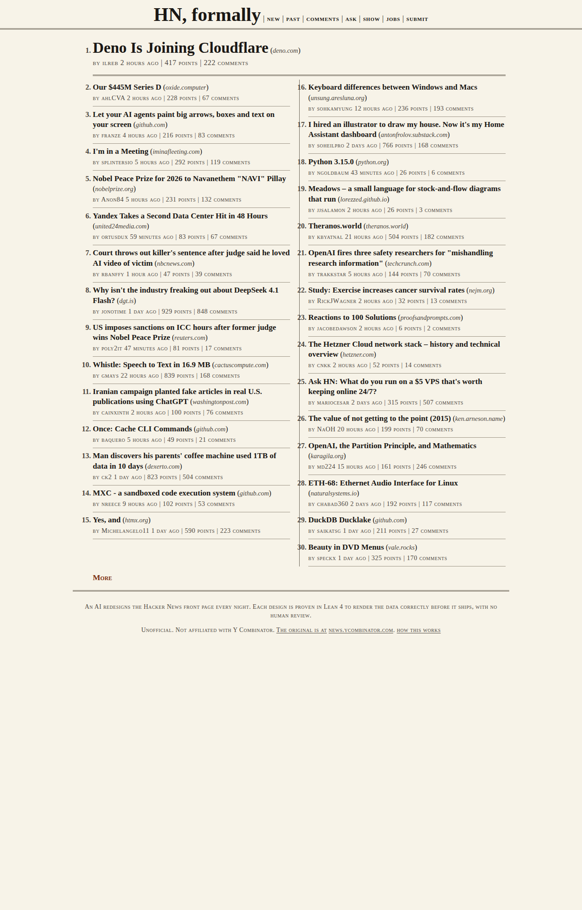
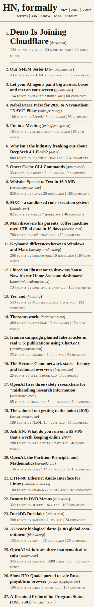
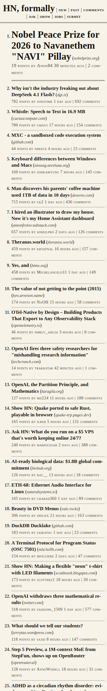
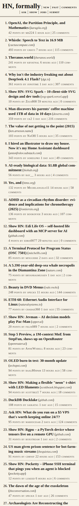
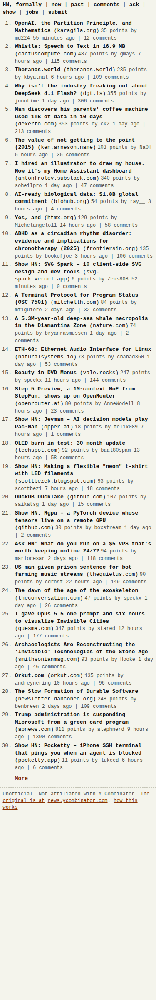

# hn-formal

**Live: [scasella.github.io/hn-formal](https://scasella.github.io/hn-formal/)**. The Hacker News front page, redesigned every night by an AI and proven in Lean 4 to render the data correctly before it ships, with no human review. Run history: [loop dashboard](https://scasella.github.io/hn-formal/loop/).

<!-- generation:start -->
## Current generation

[](https://scasella.github.io/hn-formal/)

Generation `20261009-153451-10b7ae6` (2026-10-09 15:34 UTC) · brief "newspaper broadsheet: serif masthead, columns, hairline rules, small caps for metadata" · judge 72/100 · spec v2 · new DOM · 0 repair rounds · $0.01 · [report](releases/20261009-153451-10b7ae6/report.json)

### Previous generations

<p>
<a href="releases/20261009-134625-6643a1d/"></a>
<a href="releases/20261009-105817-d1c2f42/"></a>
<a href="releases/20261009-003724-49aa276/"></a>
<a href="releases/20261009-002709-a9a323f/"></a>
</p>

Every generation, with its proof, stylesheet, report and screenshots, is under [releases/](releases/). Run history is on the [dashboard](https://scasella.github.io/hn-formal/loop/). This section is rewritten by the release step; see CONTRACT.md.
<!-- generation:end -->

**HN, formally.** An unofficial, read-only rendering of the Hacker News front
page and its discussion threads, produced by a renderer proven in Lean 4 to
render every possible HN API input correctly, redesigned autonomously by an
LLM loop, and released without human review whenever a candidate passes.

Not affiliated with Y Combinator. The original is at https://news.ycombinator.com.

See [DESIGN.md](DESIGN.md) for the agreed design, the two-tier claim, and the
trusted base; [CONTRACT.md](CONTRACT.md) for how the pieces fit.

## Status

- `HnFormal/Spec.lean` is the spec (version 2). `HnFormal/Render.lean` is
  whatever the loop last released, with its proof `render_ok`, which depends
  only on `propext`, `Classical.choice`, `Quot.sound`.
- The front page and all 30 threads render from live API data every 15
  minutes and pass both the executable check and the tier-2 browser suite.
- The loop (`orchestrator/`, `.github/workflows/redesign.yml`) runs daily;
  every release is under `releases/`, every run under `runs/`, both on the
  dashboard. The section above is rewritten by each release.

## Operating the loop

1. The loop needs the repository secret `ANTHROPIC_API_KEY`: a key from a
   dedicated Anthropic Console workspace with its own spend limit (a second
   cap behind the orchestrator's `RUN_CAP_USD` / `MONTH_CAP_USD`). Without it
   the daily `redesign` run records a failure on the dashboard; commit an
   empty `KILL_SWITCH` file at the repo root to pause every workflow instead.
2. To validate a change to the loop before the cron: dispatch `redesign` with
   small `candidates` and `rounds` inputs. It releases exactly like a
   scheduled run, so the live design changes if a candidate passes.
3. `refresh` runs every 15 minutes and deploys to GitHub Pages
   (https://scasella.github.io/hn-formal/). `redesign` runs daily at 03:17 UTC.
   `baseline` is manual only.
4. Rollback: `npm --prefix orchestrator run cli -- rollback <releaseId>`, then
   commit the two restored files and the README.

## Build and run

```bash
lake build && lake exe hnformal selftest
```

```bash
npm --prefix orchestrator ci && npm --prefix orchestrator run cli -- fetch --out data/latest.json
```

```bash
lake exe hnformal render data/latest.json out && lake exe hnformal check data/latest.json
```

Lean 4.34.1 via elan; Node 22+; Java for the HTML validator; Playwright
Chromium for tier 2 (`npx playwright install chromium` inside `orchestrator/`).

License: Apache-2.0.
